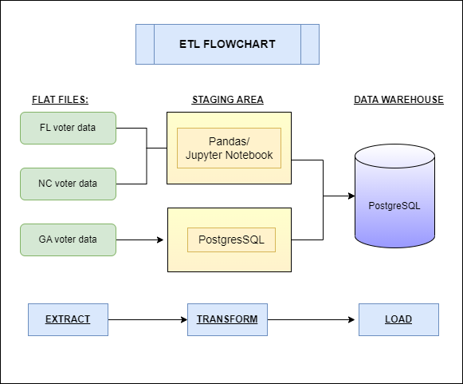
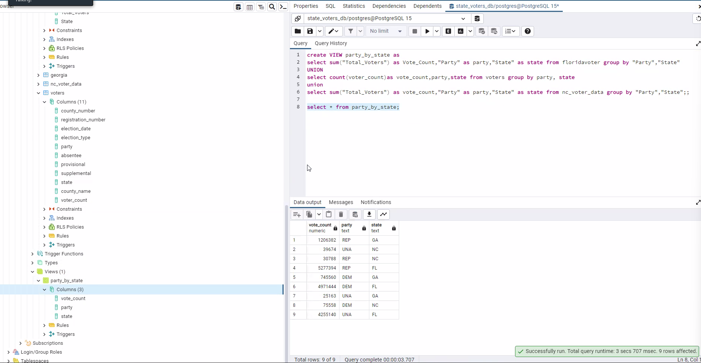
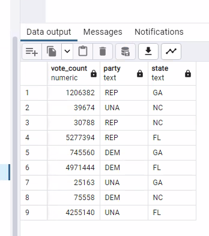

# Project_2_ETL_Challenge
Group repository for Project 2, Data Analytics &amp; Visualization

# Project Contributors:
1. Anna Barbera
2. Daniel King-Allen
3. Peter Warren

<b>Our project code and resources can be found here:  https://github.com/a-barbera/Project_2_ETL_Challenge </b>

# Voter Aggregation

<h2>Project Overview and Resources:</h2>

State level documentation of voter registration information from Florida, Georgia and North Carolina will be cleaned and standardized across the states. “Baseline” information will be identified across all three states as well as data that is better documented per state. This information will be cleaned, normalized, and then entered into a SQL database. 

1. Florida Voter Registration
https://dos.myflorida.com/elections/data-statistics/voter-registration-statistics/voter-registration-reports/

2. North Carolina: https://www.ncsbe.gov/results-data/voter-history-data
ncsbe.govncsbe.gov
Voter History Data | NCSBE
Access weekly-updated voter history data for every voter in North Carolina, or see group-level voter demographic counts. 

3. Georgia: https://sos.ga.gov/voter-history-files
sos.ga.govsos.ga.gov
Voter History Files | Georgia Secretary of State
The information and materials available on this website are provided by local elections officials as a service to the public and intended to be as accurate as possible. If the generated list appears to be missing any information regarding qualified candidates, please visit http://elections.sos.ga.gov/Elections/countyelectionoffices.do to locate the contact information for the appropriate elections office to report the issue. This list will not include anyone who has qualified to run in a municipal general or special election unless the city contracts with a county to conduct qualifying of candidates on the city's behalf.

<h2>Our Process:</h2>

1. Extraction:
    First, we gathered the voter data from the 3 states we chose and discussed the similarities and differences observed in the keys and values of those datasets, including forming a strategy around how to transform them for the smoothest possible joining further along in the process.  Based on these findings, we chose common values for our datasets to focus on, including: 
     
        <ul>
        <li>County</li>
        <li>State</li>
        <li>Party</li>
        <li>Racial Demographics</li>
        <li>Total Votes</li>
       </ul>
     

2. Transformation:
    After these preliminary decisions were made, we then read two of these documents into Jupyter Notebooks and, using pandas, created dataframes we could then futher manipulate using python code.  We then filtered the dataframes separately, choosing the columns predetermined to be of value in the extraction process, making sure the datatypes of each were appropriate and consistent with the others, and transformed some keys and values to ensure cohesive, standardized value representation across all datasets. 
    
    The third dataset was cleaned and transformed using PostgreSQL and PGAdmin in the same manner, in order to demonstrate an ability to use SQL programming to clean and transform data.  

3. Load:
    The Jupyter notebook dataframes were then exported to a PostgreSQL database as tables of the database.  Of note, any users of our project will need to have personal access to PGAdmin and postgres for this code to run properly.  We had to create the database inside of PGAdmin before being able to export the tables, so upon recreation of our project, the user will need to create the database named in the Jupyter notebook or they may choose a new name of their own preference.
   
    Each state tracked different information or stored information in a vastly different manner, especially when pertaining to race and ethnicity. Data common to all states includes political party and vote numbers. This information can be ‘stacked’ using a SQL Union if further transformation took place. Due to time constants, it was decided, for the purposes of this project, to create vote totals for each political party per state and create a SQL view where these totals could be viewed for all three states. The SQL used to create this view will is documented below.
 
 

 
 
4. Application Uses:
    The differing documentation concerning voter race and ethnicity by each state was unexpected. One state did not collect it at all. There are several state resources that publish voter information. All these resources appear to collect different data. Cleaning/Transforming this data and giving each state its own table, populated by information published by the state itself, would allow users to see how reported information differs by state. This could be of further interest over time or after a change in political parties at the state level. Users could examine if a difference in party ideology impacts the information states publish.

